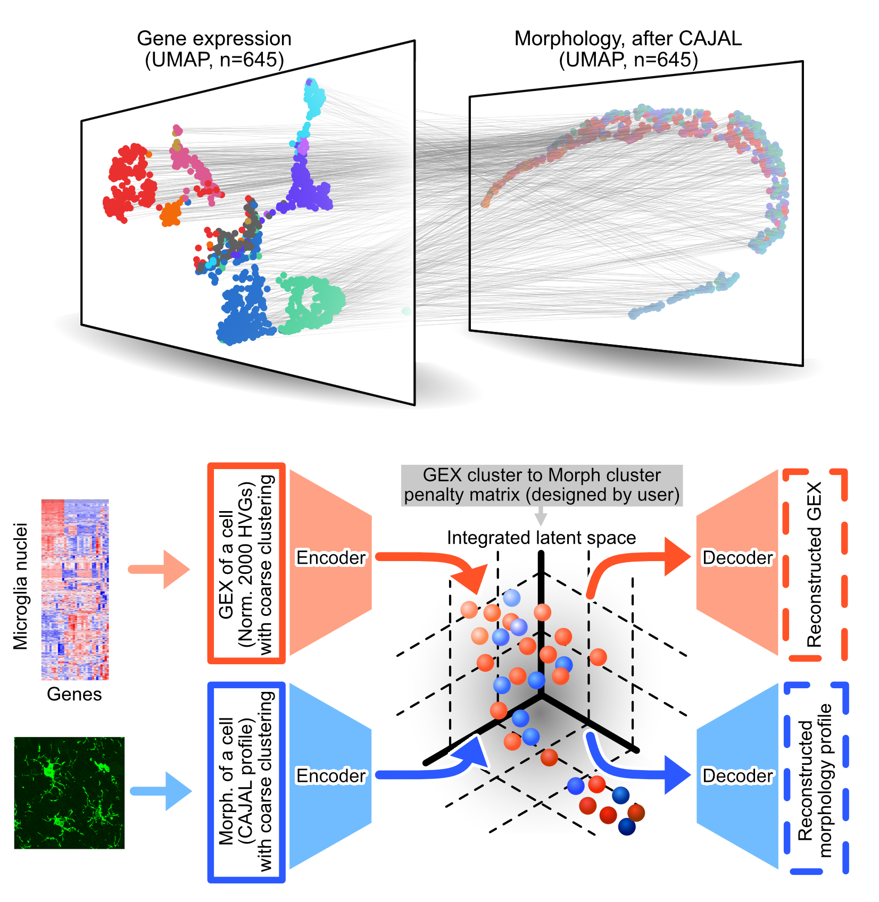

# GeoAdVAE

**GeoAdVAE** (Geometric Adversarial Variational AutoEncoder) is a cross-modal deep learning framework for integrating **single-cell morphology** and **gene expression** data.  
This repository contains the implementation, preprocessing scripts, and configuration files used in the corresponding manuscript.

<p align="center">
  
</p>

---

## 🧩 Environment & Dependencies

This project was developed and tested in a **Linux (CPU-only)** environment using **Python 3.8** managed by Conda.

### 🔧 Recommended Environment Setup

```bash
conda create -n cross_modal_cpu_env python=3.8
conda activate cross_modal_cpu_env
```

The original experiments were run in an environment located at:

```text
/home/users/turbodu/miniconda3/envs/cross_modal_cpu_env
```

---

### 📦 Core Python Dependencies

The key libraries required to run the main experiments are:

| Package | Version | Notes |
|--------|---------|-------|
| **python** | 3.8.20 | Base interpreter |
| **torch** | 2.4.1 | PyTorch deep learning framework (CPU build works for this project) |
| **torchvision** | 0.19.1 | Vision utilities for PyTorch |
| **torchaudio** | 2.4.1 | Audio utilities (dependency of PyTorch) |
| **anndata** | 0.9.2 | Annotated data matrices (used with Scanpy) |
| **scanpy** | 1.9.8 | Single-cell RNA-seq analysis |
| **umap-learn** | 0.5.7 | UMAP for dimensionality reduction |
| **pynndescent** | 0.5.13 | Nearest-neighbor search for UMAP |
| **pot** | 0.9.5 | Python Optimal Transport (Gromov–Wasserstein, etc.) |
| **captum** | 0.7.0 | Model interpretability for PyTorch |
| **tensorboardx** | 2.6.2.2 | TensorBoard logging interface |
| **numpy** | 1.24.4 | Core numerical computing |
| **pandas** | 2.0.3 | Tabular data and I/O |
| **scipy** | 1.10.1 | Scientific computing and optimization |
| **scikit-learn** | 1.3.2 | Machine learning utilities |
| **statsmodels** | 0.14.1 | Statistical modeling |
| **matplotlib** | 3.7.5 | Plotting |
| **seaborn** | 0.13.2 | Statistical data visualization |
| **numba** | 0.58.1 | JIT acceleration |
| **networkx** | 3.1 | Graph-based utilities |
| **h5py** | 3.11.0 | HDF5 file I/O |
| **pyyaml** | 5.4.1 | YAML configuration parser |
| **jinja2** | 3.1.6 | Templating (used by various tools) |

---

### 💻 Installation (CPU-only)

After creating and activating the Conda environment:

```bash
# Core deep learning and single-cell stack
pip install torch torchvision torchaudio

pip install     scanpy anndata umap-learn pynndescent     pot captum tensorboardx     numpy pandas scipy scikit-learn statsmodels     matplotlib seaborn numba networkx h5py pyyaml jinja2 tqdm session-info
```

Alternatively, if a `requirements.txt` is provided in this repository:

```bash
pip install -r requirements.txt
```

To export the exact environment used for the experiments:

```bash
conda list --export > environment.txt
```

---

---

## 🚀 Quick Start Example

### 📂 Example Implementation

We provide a complete example in the **`Example/`** folder using simulated data with 3 cell type clusters (600, 400, and 200 samples respectively).

#### **Step 1: Configure Data Paths**

Set the paths to your input data files:
```python
import os

# ========== Set Data Paths ==========
# Change this to your data directory
DATA_DIR = "{YOUR_DATA_PATH}"  # e.g., "./Example/ExampleData"

os.environ['MORPHOLOGY_PATH'] = f"{DATA_DIR}/gw_dist.csv"
os.environ['GENE_EXPRESSION_PATH'] = f"{DATA_DIR}/gene_expression.csv"
os.environ['RNA_FAMILY_PATH'] = f"{DATA_DIR}/cluster_label.csv"
os.environ['MORPHO_CLUSTER_PATH'] = f"{DATA_DIR}/cluster_label.csv"
os.environ['GEX_CLUSTER_PATH'] = f"{DATA_DIR}/cluster_label.csv"
os.environ['PRIOR_MATRIX_PATH'] = f"{DATA_DIR}/Corr_matrix.csv"

print("✓ Data paths configured")
```

#### **Step 2: Run Training**
```python
from IPython.display import Image, display

SEED = 42
CONFIG = "{YOUR_MODEL_PATH}/configs/attempt_1.yaml"
OUTPUT = "{YOUR_OUTPUT_PATH}"

# Run training
!python {YOUR_MODEL_PATH}/train.py --config {CONFIG} --output_path {OUTPUT} --seed {SEED}

# Display results
display(Image(filename=f'{OUTPUT}/outputs/attempt_1/images/_combined_final.png', width=700))

print("\n✓ Training completed!")
```

**Expected Output:**
- Cell Type Accuracy metrics
- Integrated latent space visualization

---


## 📚 Citation

If you use this codebase in your work, please cite:

> Du, J. & Lin, K. Z. **Integrating morphology and gene expression in unpaired single-cell data using GeoAdVAE**. *Preprint*, 2025.

---

## 🪪 License

This project is released under the **MIT License**.  
See the [`LICENSE`](./LICENSE) file for details.

---

## ✉️ Contact

For questions or issues related to this code, please feel free to open a GitHub issue or contact the author(s).
